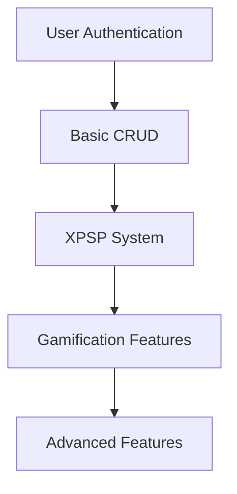

# 🚀 **Feature Priority & Dependency Mapping**

## 📊 **Dependency Analysis**

### Core Dependencies

### Feature Dependencies Map

#### 🔑 **Foundation Layer (Dependencies for All Features)**
| Feature | Dependencies | Status |
|---------|--------------|--------|
| User Auth | None | ✅ Complete |
| Database Models | User Auth | ✅ Complete |
| API Routes | Models | ✅ Complete for basic features |
| Error Handling | All | ❓ Partial |

#### 🎯 **Core Features Layer**
| Feature | Dependencies | Priority | Status |
|---------|--------------|----------|--------|
| Habit CRUD | User Auth, Habit Model | HIGH | ✅ Complete |
| Goal CRUD | User Auth, Goal Model | HIGH | ✅ Complete |
| XP System | User Model, XP Service | HIGH | ✅ Complete |
| Streak System | XP System | HIGH | ✅ Complete |

#### 🎮 **Gamification Layer**
| Feature | Dependencies | Priority | Status |
|---------|--------------|----------|--------|
| Badge Display | Badge Service, Gamification Store | HIGH | ⚠️ Backend ready, frontend integration needed |
| Achievement Notifications | Notification System | HIGH | ✅ Exists, needs frontend polish |
| Quest System | Quest Model, User Progress | MEDIUM | 📝 Model ready, implementation needed |
| Reward Store | Reward Model, XP System | MEDIUM | 📝 Model ready, implementation needed |

#### 📈 **Analytics Layer**
| Feature | Dependencies | Priority | Status |
|---------|--------------|----------|--------|
| Activity Tracking | Activity Service | MEDIUM | ✅ Basic implementation |
| Heatmap Visualization | Analytics API | LOW | ✅ Implemented |
| Progress Charts | Analytics API, Chart Libraries | MEDIUM | ❓ Partial |

#### 🔔 **Notifications Layer**
| Feature | Dependencies | Priority | Status |
|---------|--------------|----------|--------|
| Basic Notifications | User Model | HIGH | ✅ Complete |
| Email Notifications | Email Service | MEDIUM | ❓ Partial |
| Push Notifications | Notification API | LOW | 📝 Planned |

---

## 🎯 **Feature Priority Matrix**

### High Priority (Core Functionality)
| Feature | Complexity | Business Value | Status | Timeline |
|---------|------------|----------------|--------|----------|
| Habit Management | LOW | HIGH | ✅ Complete | Done |
| Goal Management | MEDIUM | HIGH | ✅ Complete | Done |
| XP & Leveling | LOW | HIGH | ✅ Complete | Done |
| Basic Analytics | MEDIUM | MEDIUM | ✅ Partial | 1-2 days |
| Badge System Integration | LOW | HIGH | ⚠️ Needs frontend | 1 day |

### Medium Priority (Enhanced Experience)
| Feature | Complexity | Business Value | Status | Timeline |
|---------|------------|----------------|--------|----------|
| Quest System | HIGH | HIGH | 📝 Planned | 3-5 days |
| Reward Store | MEDIUM | MEDIUM | 📝 Planned | 2-3 days |
| Advanced Analytics | HIGH | MEDIUM | 📝 Planned | 3-4 days |
| Habit Reminders | MEDIUM | HIGH | 📝 Planned | 2 days |
| Notification Enhancements | LOW | MEDIUM | ❓ Partial | 1-2 days |

### Low Priority (Nice-to-Have)
| Feature | Complexity | Business Value | Status | Timeline |
|---------|------------|----------------|--------|----------|
| Social Features | HIGH | LOW | 📝 Planned | 5+ days |
| Custom Themes | MEDIUM | LOW | 📝 Planned | 3 days |
| Advanced Statistics | HIGH | MEDIUM | 📝 Planned | 4 days |
| Mobile App | VERY HIGH | HIGH | 📝 Planned | 10+ days |

---

## 🔧 **Implementation Phases**

### **Phase 1: Solidify Foundation (Week 1)**
**Focus**: Bug fixes, polish existing features
**Goals**:
- Fix any issues in current implementation
- Complete badge system integration
- Add comprehensive error handling
- Improve loading states

**Estimated Time**: 3-4 days

### **Phase 2: Quest System (Week 2)**
**Focus**: Implement advanced gamification
**Goals**:
- Quest controller and routes
- Quest progress tracking
- Frontend quest management
- Daily/weekly quest logic

**Dependencies**:
- Quest model ✅
- XP system ✅
- Frontend quest components ❓

**Estimated Time**: 4-5 days

### **Phase 3: Reward System (Week 3)**
**Focus**: Monetization and engagement
**Goals**:
- Reward controller and routes
- Frontend reward store
- XP redemption system
- Inventory management

**Dependencies**:
- Reward model ✅
- XP system ✅
- User inventory system ❓

**Estimated Time**: 3-4 days

### **Phase 4: Analytics & Insights (Week 4)**
**Focus**: User engagement and data
**Goals**:
- Advanced analytics dashboard
- Habit completion statistics
- Progress visualization
- Achievement tracking

**Dependencies**:
- Analytics API ✅
- Chart components ❓
- Data aggregation logic ❓

**Estimated Time**: 3-4 days

### **Phase 5: Testing & Polish (Week 5)**
**Focus**: Quality assurance and UX
**Goals**:
- Comprehensive test suite
- E2E testing
- Performance optimization
- UI/UX improvements

**Estimated Time**: 4-5 days

---

## 📋 **Task Dependencies Breakdown**

### **Quest System Tasks**
1. ✅ Quest model (complete)
2. □ Quest controller (create)
   - Depends on: Quest model ✅
3. □ Quest routes (create)
   - Depends on: Quest controller □
4. □ Quest service (create)
   - Depends on: XP service ✅, Streak service ✅
5. □ Frontend quest store (create)
   - Depends on: Quest routes □
6. □ Quest UI components (create)
   - Depends on: Frontend quest store □

### **Reward System Tasks**
1. ✅ Reward model (complete)
2. □ Reward controller (create)
   - Depends on: Reward model ✅
3. □ Reward routes (create)
   - Depends on: Reward controller □
4. □ Reward service (create)
   - Depends on: XP service ✅
5. □ Frontend reward store (create)
   - Depends on: Reward routes □
6. □ Reward UI components (create)
   - Depends on: Frontend reward store □

### **Badge System Integration Tasks**
1. ✅ Badge service (assumed working)
2. □ Badge API integration (check/review)
3. □ Badge frontend integration
   - Depends on: BadgeDisplay component ✅, Gamification store ✅

---

## ⚠️ **Risk Assessment**

### **High Risk Factors**
| Risk | Impact | Probability | Mitigation |
|------|--------|-------------|------------|
| Quest system complexity | HIGH | MEDIUM | Break into smaller tasks, test incrementally |
| Database performance | HIGH | LOW | Implement proper indexing, monitor queries |
| Frontend state management | MEDIUM | LOW | Use existing patterns, comprehensive testing |

### **Critical Path**
The most critical path for project success:
1. ✅ User Authentication (foundation)
2. ✅ Habit System (core feature)
3. ✅ XP System (gamification)
4. □ Badge Integration (immediate next step)
5. □ Quest System (major feature)

**Blocking Factors**: None currently - all dependencies satisfied for next phase

---

## 🔄 **Rollback Strategy**

### **Per Feature Rollback**
- **Database**: Migration rollback scripts
- **API**: Feature flags for gradual rollout
- **Frontend**: Component-level fallbacks

### **Emergency Rollback**
- Complete system rollback to last stable commit
- Database backup and restore procedures
- User communication template

---

## 📊 **Success Metrics**

### **Phase Success Criteria**
| Phase | Success Metric | Target | Measurement |
|-------|----------------|--------|-------------|
| 1 | Zero critical bugs | 100% | User feedback, testing |
| 2 | Quest completion rate | >50% | Analytics tracking |
| 3 | Reward redemption rate | >30% | XP economy balance |
| 4 | Analytics usage | >70% | Page view tracking |
| 5 | Test coverage | >80% | Automated reports |

### **Overall Project Success**
- User engagement (daily active users)
- Habit completion rates
- Feature adoption rates
- Technical performance metrics
